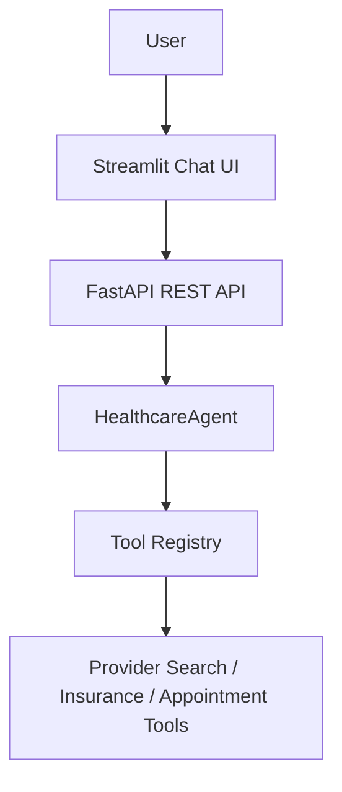

# Healthcare AI Agent

A goal-oriented healthcare scheduling assistant that combines an OpenAI-powered
reasoning agent with provider search, insurance verification, and appointment
booking tools. The project exposes a FastAPI REST API and a Streamlit chat
interface.

> This project is a demonstration application and is not a substitute for
> professional medical advice, diagnosis, or emergency services.

## Features

- Iterative multi-tool reasoning until the user's scheduling goal is complete
- Provider discovery with nearby-location fallback
- Insurance acceptance verification
- Appointment booking and confirmation
- Centralized tool registration and validated tool inputs
- FastAPI backend with validation, dependency injection, and Swagger docs
- Streamlit chat interface with session history and friendly error handling
- Environment-based configuration and structured application logging

## Architecture



See [docs/architecture.md](docs/architecture.md) for the detailed request and
tool-execution flows.

## Folder Structure

```text
healthcare-agent/
├── app/
│   ├── agent/              # Agent orchestration and reasoning loop
│   ├── api/                # FastAPI application, routes, and schemas
│   ├── llm/                # OpenAI client creation
│   ├── prompts/            # Production system prompt
│   ├── tools/              # Healthcare tool implementations and registry
│   ├── ui/                 # Streamlit chat application
│   ├── config.py           # Environment settings and logging configuration
│   └── main.py             # Optional command-line interface
├── docs/
│   └── architecture.md     # Architecture documentation and diagrams
├── tests/                  # Automated tests
├── Dockerfile              # Shared production container image
├── docker-compose.yml      # FastAPI and Streamlit service orchestration
├── .dockerignore           # Docker build context exclusions
├── .env.example            # Environment variable template
└── requirements.txt        # Python dependencies
```

## Installation

Python 3.10 or newer is required.

```powershell
git clone <repository-url>
cd healthcare-agent
python -m venv .venv
.\.venv\Scripts\Activate.ps1
python -m pip install -r requirements.txt
Copy-Item .env.example .env
```

Add your OpenAI API key to `.env`:

```dotenv
OPENAI_API_KEY=your_api_key_here
BACKEND_URL=http://localhost:8000
```

Never commit the populated `.env` file.

## Running FastAPI

Start the backend from the repository root:

```powershell
uvicorn app.api.main:app --reload
```

The API is available at `http://localhost:8000`. Interactive Swagger
documentation is available at `http://localhost:8000/docs`.

## Running Streamlit

With the FastAPI backend running, open another terminal and start the frontend:

```powershell
streamlit run app/ui/streamlit_app.py
```

To use a backend at another address, set `BACKEND_URL` in `.env` before starting
Streamlit.

## Docker

Docker Compose builds one application image and runs it as two services:

- `healthcare-api` serves FastAPI at `http://localhost:8000`.
- `healthcare-ui` serves Streamlit at `http://localhost:8501`.

Copy the environment template and set `OPENAI_API_KEY` before starting the
stack:

```powershell
Copy-Item .env.example .env
```

Build the image:

```powershell
docker compose build
```

Start both services:

```powershell
docker compose up
```

The Streamlit service waits for the FastAPI health check to pass before it
starts. Stop and remove the containers and Compose network with:

```powershell
docker compose down
```

## Example Requests

Check service status:

```powershell
curl.exe http://localhost:8000/
```

```json
{
  "service": "Healthcare AI Agent",
  "status": "running",
  "version": "1.0.0"
}
```

Send a chat request:

```powershell
curl.exe -X POST http://localhost:8000/chat `
  -H "Content-Type: application/json" `
  -d '{"message":"Find a cardiologist who accepts my insurance."}'
```

```json
{
  "response": "Assistant response"
}
```

## Screenshots

_Screenshots of the Streamlit chat interface and Swagger documentation will be
added here._

## Future Improvements

- Persist separate conversation histories for authenticated users
- Add production authentication and authorization
- Store provider and appointment data in a durable database
- Add rate limiting, request tracing, and operational metrics
- Expand automated unit, integration, and end-to-end test coverage
- Add continuous integration and automated container publishing
