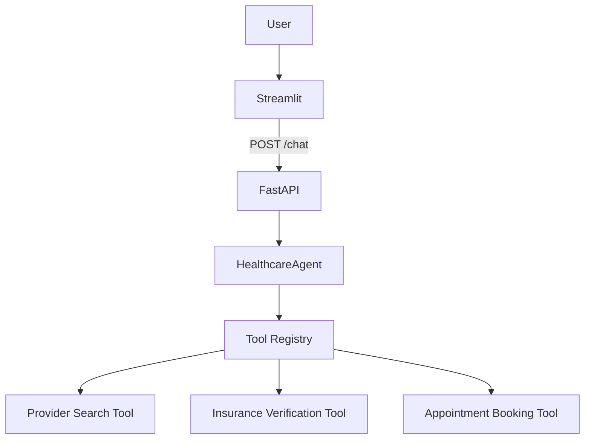
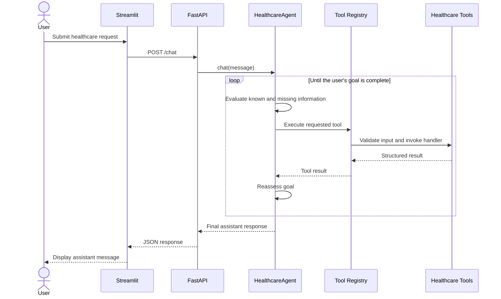

# Architecture

The Healthcare AI Agent uses a layered architecture. The Streamlit frontend is
an API client and does not access the agent or OpenAI directly. FastAPI validates
requests and delegates them to the singleton `HealthcareAgent`, which coordinates
LLM reasoning and registered healthcare tools.

## System Components

## Request and Tool Execution Flow

## Configuration

Runtime configuration is loaded from environment variables, with local `.env`
support:

- `OPENAI_API_KEY` authenticates the backend OpenAI client.
- `BACKEND_URL` tells Streamlit where to reach FastAPI.

The service version is `1.0.0` and is exposed by the root health endpoint and
the generated OpenAPI schema.
