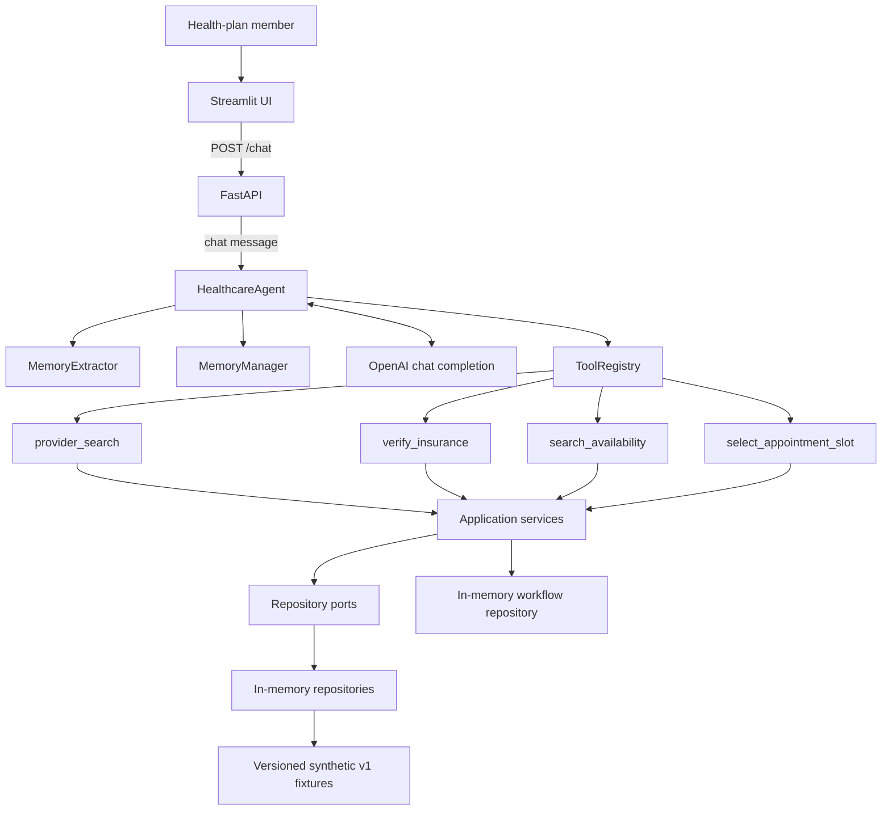
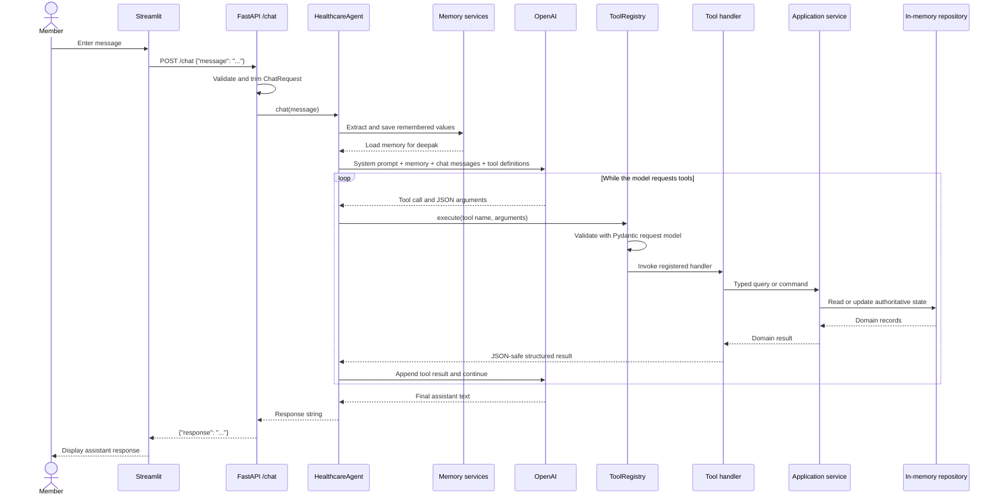
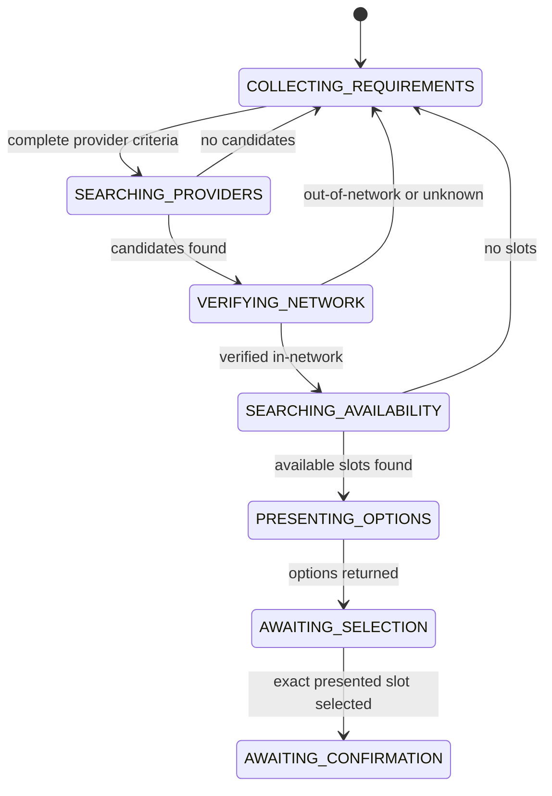

# Current Application Architecture

## Purpose

This document explains the architecture that exists in the repository after
Phase 1 and Phase 2. It is the recommended starting point for a developer who
is new to the project and needs to understand how a member message becomes an
agent response.

The application is a synthetic Provider Navigation and Scheduling Agent. It can:

- Remember a small amount of member information.
- Search a structured synthetic provider directory.
- Verify plan-, location-, specialty-, and date-specific network participation.
- Search structured synthetic appointment slots.
- Persist scheduling workflow state separately from chat messages.
- Allow the member to select an exact appointment slot.
- Stop at `AWAITING_CONFIRMATION`.

The application does **not** currently book an appointment. Phase 3 is planned
but has not been implemented. No current response should claim that a booking
was completed or return a booking confirmation number.

## Implementation Status

| Phase | Status | Result |
| --- | --- | --- |
| Phase 1: domain models and service ports | Implemented | Provider and network facts come from typed synthetic records through service and repository interfaces. |
| Phase 2: availability and workflow state | Implemented | The agent can search slots, persist validated workflow transitions, and reach `AWAITING_CONFIRMATION`. |
| Phase 3: confirmed, idempotent booking | Not implemented | Confirmation fingerprints, slot revalidation, transactional booking, idempotency, and authoritative booking confirmations are still future work. |

`docs/product-spec.md` defines the product requirements.

`docs/target-architecture.md` defines the intended production architecture and
later migration phases.

This document describes the code that is running now.

## Architectural Principles

The current implementation follows these rules:

1. FastAPI handles HTTP concerns and delegates orchestration to
   `HealthcareAgent`.
2. `HealthcareAgent` owns memory coordination and the LLM tool-calling loop.
3. The LLM chooses which registered capability to request, but it is not the
   source of truth for member coverage, providers, network status, slots, or
   workflow state.
4. Tool handlers validate model arguments and translate them into application
   service calls.
5. Application services enforce deterministic healthcare rules.
6. Repository interfaces separate application logic from synthetic storage.
7. Workflow state is persisted independently from the LLM message history.
8. Missing or invalid network evidence fails closed as `unknown`.
9. Booking is unavailable until Phase 3 establishes a safe transaction.

## System Overview



The OpenAI model coordinates the conversation. Structured services and
repositories determine factual and stateful outcomes.

## Layer Responsibilities

| Layer | Primary files | Responsibility |
| --- | --- | --- |
| Streamlit UI | `app/ui/streamlit_app.py` | Collect messages, call FastAPI, and render user, assistant, and error messages. |
| HTTP/API | `app/api/main.py`, `app/api/routes/chat.py`, `app/api/schemas.py` | Validate HTTP requests, resolve the cached agent dependency, serialize access with a lock, and return stable responses. |
| Agent orchestration | `app/agent/healthcare_agent.py` | Extract memory, build LLM context, invoke OpenAI, execute tool calls, and continue until the model returns normal assistant text. |
| Tool registry | `app/tools/tool_registry.py` | Store tool definitions, validate arguments using Pydantic, and invoke the registered handler. |
| Tool adapters | `app/tools/provider_search.py`, `app/tools/insurance.py`, `app/tools/availability.py` | Translate model-facing requests into domain inputs and translate domain results into JSON-safe tool results. |
| Application services | `app/application/services.py`, `app/application/scheduling_services.py` | Enforce member coverage, provider search, network verification, availability filtering, and workflow transition rules. |
| Service interfaces | `app/application/service_interfaces.py` | Define stable application-facing protocols for services. |
| Repository ports | `app/application/ports.py` | Define persistence contracts without depending on a database or vendor. |
| Domain | `app/domain/models.py` | Define healthcare entities, queries, results, workflow state, and selection snapshots. |
| Synthetic infrastructure | `app/infrastructure/synthetic/` | Compose services, implement repository ports in memory, and provide versioned synthetic data. |
| Memory | `app/memory/` | Extract and persist simple member preferences in process memory. |
| LLM adapter | `app/llm/llm_client.py` | Construct the OpenAI client. |
| Prompt | `app/prompts/system_prompt.py` | Tell the model how to coordinate provider, network, availability, and selection tools. |

## Application Startup and Dependency Construction

### FastAPI startup

`app/api/main.py` creates the FastAPI application and includes the chat router.

`app/api/routes/chat.py` owns three process-level objects:

- One `MemoryManager`.
- One `ToolRegistry`.
- One cached `HealthcareAgent`, created by `get_healthcare_agent()`.

The agent dependency is cached with `@lru_cache(maxsize=1)`. This means all chat
requests in the process currently share one agent instance, one agent message
history, and one in-memory synthetic service graph.

An `agent_lock` serializes access to that singleton. This prevents simultaneous
requests from mutating the shared message list at the same time, but it is not
the final multi-user architecture.

### Synthetic composition

When `HealthcareAgent` is constructed without an explicitly supplied
`HealthcareServices`, it calls:

```python
build_synthetic_services()
```

`app/infrastructure/synthetic/composition.py` creates:

- Member repository
- Enrollment repository
- Health-plan repository
- Provider-network repository
- Provider repository
- Provider-location repository
- Network-participation repository
- Slot repository
- Appointment repository
- Workflow repository

It then injects those repository implementations into the corresponding
application services. Tests can construct the same graph or supply controlled
dependencies.

## End-to-End Chat Request



### What `HealthcareAgent.chat()` does

For each user message:

1. `MemoryExtractor.extract(user_input)` looks for supported memory patterns.
2. Extracted values are saved through `MemoryManager.save()`.
3. Memory for the hardcoded member `"deepak"` is loaded.
4. A memory system message is appended when memory exists.
5. The current user message is appended to `self.messages`.
6. The agent calls OpenAI with:
   - Model configuration
   - The accumulated message list
   - Registered tool definitions
7. If the assistant message contains tool calls, each call is validated and
   executed.
8. Tool results are appended with role `tool`.
9. The loop calls the model again.
10. The first assistant message without tool calls becomes the API response.

The loop itself is generic. Phase 1 and Phase 2 changed the tools and services
behind it rather than replacing the loop.

## Current Tools

| Tool | Validated request | Service behavior | Workflow effect |
| --- | --- | --- | --- |
| `provider_search` | Location, specialty, optional provider gender | Searches active typed provider and location records. | Records requirements, enters `SEARCHING_PROVIDERS`, then moves to `VERIFYING_NETWORK` when candidates exist or back to `COLLECTING_REQUIREMENTS` when none exist. |
| `verify_insurance` | Insurance, provider, location, specialty, service date | Resolves Deepak's active plan and verifies the exact provider/location/specialty/date participation record. | Moves an in-network candidate to `SEARCHING_AVAILABILITY`; otherwise returns to `COLLECTING_REQUIREMENTS`. |
| `search_availability` | Provider ID, provider-location ID, date range, optional modality | Returns matching slots whose authoritative status is `available`. | Moves through `PRESENTING_OPTIONS` to `AWAITING_SELECTION`, or returns to `COLLECTING_REQUIREMENTS` when no slots exist. |
| `select_appointment_slot` | Previously presented slot ID | Reloads the current slot and stores an exact selection snapshot. | Moves from `AWAITING_SELECTION` to `AWAITING_CONFIRMATION`. |

The model-facing tool schemas do not accept an authoritative member ID or
network status. Those values come from trusted application context and service
results.

`app/tools/appointment.py` is a legacy hardcoded module. It is intentionally
**not registered** with `HealthcareAgent` after Phase 2 and is not part of the
active agent workflow.

## Memory

Memory orchestration is owned by `HealthcareAgent`, not FastAPI.

The current memory implementation is deliberately small:

- `MemoryExtractor` recognizes statements matching “my name is ...”.
- `MemoryManager` stores preferences in an in-process dictionary.
- The member ID is hardcoded as `"deepak"`.
- Loaded memory is appended to the LLM context as a system message.

Example:

```text
User: My name is Deepak.
MemoryExtractor: {"name": "Deepak"}
MemoryManager: saves the value for deepak

User: What's my name?
HealthcareAgent: loads memory and includes it in the LLM context
Assistant: Your name is Deepak.
```

Memory is not durable and is not isolated for authenticated users yet. Those
changes belong to later identity and persistence phases.

## Domain Model

`app/domain/models.py` contains framework-independent dataclasses and enums.

### Member and coverage

- `Member`
- `Enrollment`
- `HealthPlan`
- `ProviderNetwork`
- `MemberCoverageContext`

The active enrollment for the service date determines the applicable health
plan and network.

### Provider directory and network participation

- `Provider`
- `ProviderLocation`
- `NetworkParticipation`
- `ProviderSearchCriteria`
- `ProviderCandidate`
- `NetworkVerificationResult`
- `NetworkStatus`

Allowed network results are:

- `in_network`
- `out_of_network`
- `unknown`

No active record, an expired record, conflicting records, or inactive member
coverage cannot become `in_network`.

### Availability and selection

- `AppointmentSlot`
- `AvailabilityQuery`
- `AppointmentSelection`

`AppointmentSelection` snapshots the exact:

- Slot ID and version
- Provider ID
- Provider-location ID
- Start and end time
- Time zone
- Modality
- Network status
- Health plan and network
- Network source reference
- Network service date

This snapshot is the input that Phase 3 will eventually bind to explicit
confirmation.

### Workflow

- `WorkflowState`
- `SchedulingWorkflow`
- `ProviderReference`

The workflow stores search criteria, provider candidates, the authoritative
network result, the availability query, presented slot IDs, the selected slot,
timestamps, and an optimistic version number.

## Application Services

### Phase 1 services

`DefaultMemberProfileService`

- Loads an active member.
- Requires exactly one active enrollment for the service date.
- Resolves the plan and active network.
- Fails when an authoritative coverage context cannot be built.

`DefaultProviderDirectoryService`

- Filters active providers by specialty, location, and optional gender.
- Resolves an exact provider and location for network verification.
- Returns structured `ProviderCandidate` values.

`DefaultNetworkVerificationService`

- Uses the member's plan network.
- Matches provider, provider location, specialty or service, and service date.
- Returns `unknown` when no single active participation record exists.
- Returns source provenance with an authoritative result.

### Phase 2 services

`DefaultAvailabilityService`

- Filters by provider ID.
- Filters by provider-location ID.
- Applies an inclusive date range.
- Applies an optional modality.
- Returns only slots whose current status is `available`.
- Sorts results chronologically.
- Can reload one current slot by its stable ID.

`DefaultSchedulingWorkflowService`

- Creates or resumes one workflow for the synthetic member and conversation.
- Is the only component allowed to change workflow state.
- Verifies that network results refer to provider candidates.
- Verifies that availability refers to the in-network provider and location.
- Records only slots returned by the active availability query.
- Rejects selection of a slot that was not presented.
- Rejects unavailable or network-mismatched selections.
- Uses repository version checks to detect stale workflow writes.

## Scheduling Workflow



The implemented state machine ends at `AWAITING_CONFIRMATION`.

Important invariants:

- Only `DefaultSchedulingWorkflowService` performs transitions.
- A network result must refer to a candidate from the current provider search.
- Availability must match the verified provider and location.
- Only available slots from the active query may be presented.
- A member may select only a slot that was presented by the workflow.
- The selection must retain in-network provenance.
- Invalid transitions raise `InvalidWorkflowTransition`.
- Repository writes use an expected workflow version.

Workflow state is stored by `InMemoryWorkflowRepository`. It is not inferred
from assistant prose and is not stored only in the LLM message list.

## Synthetic Data and Persistence

`app/infrastructure/synthetic/fixtures/v1.py` contains versioned fictitious
records for:

- Members
- Enrollments
- Health plans
- Provider networks
- Providers
- Provider locations
- Network participation
- Appointment slots
- An initially empty appointment collection

The fixtures deliberately include:

- Multiple plans and networks
- Plan-specific network differences
- Location-specific participation
- Expired participation
- In-network and out-of-network results
- Available, booked, in-person, and virtual slots

`app/infrastructure/synthetic/repositories.py` implements the repository ports
with in-memory collections. These collections are authoritative for the current
process but disappear when the process restarts.

The workflow repository enforces optimistic version matching. It does not
provide database transactions or multi-process durability.

## Phase Summary

### Phase 1: Domain Models and Service Ports — implemented

Before Phase 1, provider search returned one hardcoded doctor and insurance
verification always returned accepted.

Phase 1 introduced:

- Typed member, enrollment, plan, network, provider, location, participation,
  slot, and appointment models.
- Application service interfaces.
- Repository ports.
- Versioned synthetic fixtures.
- In-memory repository adapters.
- Deterministic member coverage resolution.
- Structured provider search.
- Plan-, provider-, location-, specialty-, and date-specific network
  verification.
- `in_network`, `out_of_network`, and fail-closed `unknown` outcomes.
- Thin compatibility handlers behind the existing tool registry.
- Offline tests for domain, repositories, services, tools, the API, memory, and
  the multi-tool agent loop.

The major architectural result was:

```text
LLM tool request
-> validated tool handler
-> application service
-> repository port
-> synthetic repository
-> authoritative structured result
```

### Phase 2: Availability and Workflow State — implemented

Before Phase 2, availability was not modeled and workflow progress existed only
implicitly in model messages.

Phase 2 introduced:

- Typed `AvailabilityQuery`.
- Expanded synthetic appointment slots.
- `AvailabilityService`.
- `SchedulingWorkflow` and `WorkflowState`.
- `WorkflowRepository`.
- `InMemoryWorkflowRepository`.
- Optimistic workflow versions.
- Validated workflow transitions.
- Exact `AppointmentSelection` snapshots.
- `search_availability`.
- `select_appointment_slot`.
- Two-turn agent behavior in which options are presented before a member
  selects one.
- Tests for valid transitions, invalid transitions, no availability,
  authoritative slot selection, repository version conflicts, tool schemas,
  and the complete agent path to `AWAITING_CONFIRMATION`.

Phase 2 also removed the legacy hardcoded booking capability from the active
agent registry. The prompt now tells the model to stop after presenting the
selected details and requesting explicit confirmation.

### Phase 3: Confirmation and Idempotent Booking — planned

Phase 3 has **not** been implemented in the current repository.

It should add:

- A confirmation summary containing the exact provider, location, time,
  modality, and network result.
- A deterministic selection fingerprint binding confirmation to the exact
  details shown to the member.
- Confirmation expiration.
- A separate preparation operation and booking operation.
- A validated transition from `AWAITING_CONFIRMATION` to `BOOKING`.
- Immediate slot revalidation before booking.
- An idempotency key that prevents duplicate appointments.
- Atomic workflow, slot, and appointment persistence.
- An authoritative booking result and confirmation number produced by the
  booking service rather than the LLM.
- Safe handling for slot loss, timeouts, duplicate confirmation, and definitive
  booking failures.
- Tests proving zero bookings without matching explicit confirmation and zero
  duplicate appointments from repeated confirmation.

The expected Phase 3 flow is:

```text
AWAITING_CONFIRMATION
-> present exact confirmation summary
-> receive matching explicit member confirmation
-> validate fingerprint and expiration
-> revalidate current slot
-> create or reuse idempotent booking
-> persist authoritative result
-> CONFIRMED
```

Until Phase 3 exists, `AWAITING_CONFIRMATION` is a terminal point for the
running application.

## Testing Architecture

The test suite is deterministic and offline.

`tests/conftest.py` supplies:

- A fake OpenAI client.
- Queued assistant messages.
- Structured fake tool calls.
- An `agent_factory` that replaces `get_llm_client`.

The fake client records every completion request and returns predefined model
messages. Tests therefore exercise the real agent loop and real tools without
calling OpenAI.

Key test areas:

| Test file | Coverage |
| --- | --- |
| `tests/test_memory.py` | Extraction, persistence, and memory behavior. |
| `tests/test_chat_api.py` | FastAPI delegation, validation, success, and errors. |
| `tests/test_tool_registry.py` | Registration, Pydantic validation, execution, and errors. |
| `tests/test_healthcare_services.py` | Provider search, coverage resolution, and network verification. |
| `tests/test_healthcare_tools.py` | Provider and network tool contracts. |
| `tests/test_scheduling_services.py` | Availability and workflow rules. |
| `tests/test_scheduling_tools.py` | Availability and selection tool contracts. |
| `tests/test_synthetic_repositories.py` | Repository behavior and workflow version enforcement. |
| `tests/test_healthcare_agent.py` | Memory recall, tool registration, errors, and multi-turn orchestration. |

Run the local quality checks with:

```powershell
python -m pytest -q
python -m compileall -q app tests
terraform fmt -check -recursive terraform
git diff --check
```

GitHub Actions runs the equivalent checks for pull requests and pushes to
`main`.

## Current Trust Boundaries

### Facts the LLM may coordinate but must not invent

- Member coverage
- Provider identity
- Provider location
- Network status
- Network source reference
- Appointment slot
- Workflow state
- Selection status
- Booking status
- Confirmation number

### Authoritative sources today

| Fact | Current source |
| --- | --- |
| Member and active enrollment | Synthetic member and enrollment repositories |
| Applicable plan and network | Health-plan and provider-network repositories |
| Provider and location | Provider repositories |
| Network status | Network-participation repository and verification service |
| Availability | Slot repository and availability service |
| Workflow state | Workflow repository and workflow service |
| Memory | In-process `MemoryManager` |
| Booking | Not available |

## Current Limitations

New team members should understand these limitations before extending the
system:

1. The member ID is hardcoded as `"deepak"`.
2. Scheduling uses a hardcoded synthetic conversation ID.
3. There is no authentication or authorization boundary.
4. One cached `HealthcareAgent` and one message list are shared by the process.
5. The API lock serializes chat requests rather than providing request-safe
   conversation isolation.
6. Memory, workflows, slots, and appointments are in memory and disappear on
   restart.
7. Memory extraction currently recognizes only a name pattern.
8. The UI sends only a message; it does not send authenticated identity or a
   conversation ID.
9. Provider search supports only a small subset of the target ranking and
   preference behavior.
10. No real payer, provider-directory, FHIR, EHR, or scheduling integrations
    exist.
11. Booking, confirmation fingerprints, expiration, idempotency, transaction
    handling, and reconciliation are not implemented.
12. `app/tools/appointment.py` is legacy code and is not an active tool.
13. Error handling is primarily generic HTTP error translation.
14. The application is not ready for real protected health information.

## Where to Start When Changing the Code

Use this dependency direction:

```text
UI
-> FastAPI
-> HealthcareAgent
-> ToolRegistry and tool adapters
-> Application service interfaces
-> Application service implementations
-> Repository ports
-> Synthetic or future real adapters
```

When adding a healthcare capability:

1. Define or extend framework-independent domain types.
2. Define the service or repository interface.
3. Implement deterministic application rules.
4. Implement or extend a synthetic adapter.
5. Add a thin, validated tool handler.
6. Register the tool in `HealthcareAgent`.
7. Add unit, service, tool, and agent-loop tests.
8. Keep FastAPI limited to HTTP handling.
9. Do not allow model-provided identifiers or prose to become authoritative
   state without application validation.

For Phase 3 specifically, begin with the confirmation and booking domain
contracts. Do not reactivate the legacy appointment tool.
