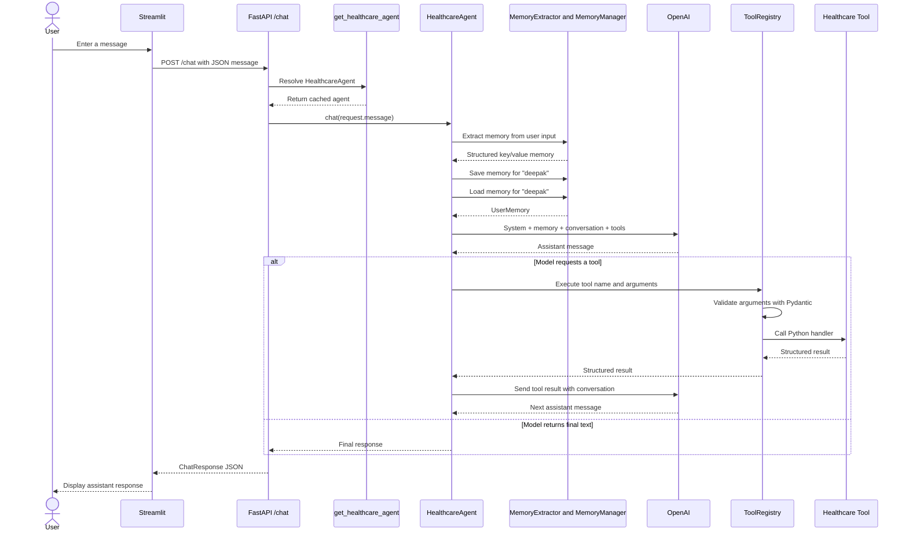

# Current Application Walkthrough

## Purpose

This document explains how the current Healthcare AI Agent works. Use it as a
reference when you forget where a request goes, how the agent calls the model,
how tools execute, or where conversation and memory state are stored.

You do not need to memorize every line of code. Focus on:

1. Where a request enters the application
2. Which component owns each responsibility
3. How data moves between components
4. Where state is stored
5. What happens when something fails

## Application at a Glance

The application consists of two running services:

| Service | Local URL | Responsibility |
| --- | --- | --- |
| Streamlit | `http://localhost:8501` | Displays the chat interface |
| FastAPI | `http://localhost:8000` | Hosts the API and healthcare agent |

The chat endpoint is:

```text
POST http://localhost:8000/chat
```

The URL is only an address. It does not contain the conversation.

The current user message is sent in the HTTP request body:

```json
{
  "message": "Find me a dermatologist near Plano"
}
```

FastAPI returns the current assistant response:

```json
{
  "response": "I found a dermatologist in Plano."
}
```

## Complete Request Flow



The shortest mental model is:

```text
Streamlit
-> FastAPI route
-> HealthcareAgent
-> OpenAI
-> optional tools
-> HealthcareAgent
-> FastAPI response
-> Streamlit
```

## Important Files

| File | Responsibility |
| --- | --- |
| `app/ui/streamlit_app.py` | Chat interface and HTTP client |
| `app/api/main.py` | Creates the FastAPI application |
| `app/api/routes/chat.py` | Defines the `/chat` endpoint |
| `app/api/schemas.py` | Validates API requests and responses |
| `app/agent/healthcare_agent.py` | Owns memory and the LLM/tool loop |
| `app/prompts/system_prompt.py` | Defines the agent's system instructions |
| `app/llm/llm_client.py` | Creates the OpenAI client |
| `app/tools/tool_registry.py` | Registers, validates, and executes tools |
| `app/tools/provider_search.py` | Current provider-search tool |
| `app/tools/insurance.py` | Current insurance-verification tool |
| `app/tools/appointment.py` | Current appointment-booking tool |
| `app/memory/memory_extractor.py` | Extracts structured memory from text |
| `app/memory/memory_manager.py` | Saves and loads in-process user memory |
| `tests/conftest.py` | Provides the fake OpenAI client |
| `tests/test_healthcare_agent.py` | Tests memory and multi-tool behavior |
| `tests/test_chat_api.py` | Tests the FastAPI boundary |

## Step 1: Streamlit Receives the Message

The interaction starts with:

```python
if user_message := st.chat_input(
    "How can I help with your healthcare needs?"
):
```

Streamlit stores the message for display:

```python
{
    "role": "user",
    "content": user_message,
    "is_error": False,
}
```

It then calls:

```python
assistant_response, is_error = request_assistant_response(
    user_message
)
```

`request_assistant_response()` sends:

```python
requests.post(
    chat_url,
    json={"message": message},
    timeout=REQUEST_TIMEOUT_SECONDS,
)
```

### What `chat_url` Means

The UI creates:

```python
chat_url = f"{get_backend_url()}/chat"
```

Locally:

```text
get_backend_url() = http://localhost:8000
chat_url          = http://localhost:8000/chat
```

Think of the URL as a mailing address:

- The URL tells Streamlit where to send the request.
- The JSON body contains the message.
- The URL does not contain user or assistant roles.

## Step 2: FastAPI Validates the Request

The request body is validated by:

```python
class ChatRequest(BaseModel):
    message: str = Field(min_length=1)
```

The validator removes surrounding whitespace:

```python
message = message.strip()
```

Therefore:

```json
{
  "message": "  Hello  "
}
```

becomes:

```text
Hello
```

Invalid requests receive HTTP `422` before the agent is called.

## Step 3: FastAPI Selects the Chat Route

The chat router is created with:

```python
router = APIRouter(tags=["chat"])
```

`tags=["chat"]` groups the endpoint under **chat** in Swagger documentation. It
does not change the URL.

The route is registered with:

```python
@router.post(
    "/chat",
    response_model=ChatResponse,
    status_code=status.HTTP_200_OK,
    responses={
        status.HTTP_500_INTERNAL_SERVER_ERROR: {...},
        status.HTTP_503_SERVICE_UNAVAILABLE: {...},
    },
)
```

This means:

- Accept `POST /chat`
- Validate successful responses as `ChatResponse`
- Return HTTP `200` on success
- Document possible `500` and `503` errors

The router becomes part of the FastAPI application through:

```python
app.include_router(chat_router)
```

Without `include_router()`, the `/chat` endpoint would not exist.

## Step 4: FastAPI Dependency Injection Provides the Agent

The route signature contains:

```python
agent: Annotated[
    HealthcareAgent,
    Depends(get_healthcare_agent),
]
```

This tells FastAPI:

> Call `get_healthcare_agent()` and use its result as the `agent` argument.

The dependency provider is:

```python
@lru_cache(maxsize=1)
def get_healthcare_agent() -> HealthcareAgent:
```

The first request constructs the agent. Because the function is cached, later
requests receive the same instance.

The route then delegates the user message:

```python
response = agent.chat(request.message)
```

The route does not:

- Call OpenAI directly
- Extract memory
- Execute healthcare tools
- Decide which provider to use

Its job is HTTP handling and delegation.

## Step 5: HealthcareAgent Builds LLM Context

`HealthcareAgent` receives only the current user message:

```python
agent.chat("Find me a dermatologist near Plano")
```

The agent combines it with:

- The system prompt
- Extracted memory
- Loaded memory
- Previous user and assistant messages
- Previous tool calls and results
- Available tool definitions

The complete LLM context is stored in:

```python
self.messages
```

The initial value is:

```python
[
    {
        "role": "system",
        "content": SYSTEM_PROMPT,
    }
]
```

## Step 6: Memory Is Extracted and Loaded

The agent calls:

```python
memories = self.memory_extractor.extract(user_input)
```

The current extractor recognizes:

```text
My name is Deepak
```

and returns:

```python
{"name": "Deepak"}
```

The agent saves the result:

```python
for key, value in memories.items():
    self.manager.save("deepak", key, value)
```

It then loads the user's memory:

```python
user_memory = self.manager.load("deepak")
```

The memory is added to the model context as a system message:

```python
{
    "role": "system",
    "content": (
        "Use this known user memory when relevant: "
        '{"name": "Deepak"}'
    ),
}
```

### Current Memory Storage

`MemoryManager` uses:

```python
self.user_memories: dict[str, UserMemory] = {}
```

This means memory:

- Exists only in the FastAPI process
- Disappears when the process restarts
- Is not shared across multiple server processes
- Currently uses the hardcoded user ID `"deepak"`

## Step 7: The Current User Message Is Added

The agent adds:

```python
{
    "role": "user",
    "content": user_input,
}
```

At this point, `self.messages` may look like:

```python
[
    {
        "role": "system",
        "content": "You are a goal-oriented healthcare assistant...",
    },
    {
        "role": "system",
        "content": (
            'Use this known user memory when relevant: '
            '{"name": "Deepak"}'
        ),
    },
    {
        "role": "user",
        "content": "What's my name?",
    },
]
```

## Step 8: The Agent Calls OpenAI

The agent calls:

```python
self.client.chat.completions.create(
    model=DEFAULT_MODEL,
    messages=self.messages,
    temperature=TEMPERATURE,
    tools=self.registry.get_tool_definitions(),
)
```

The model receives both conversation context and tool descriptions.

The result is read from:

```python
response.choices[0].message
```

## Step 9: The Agent Decides Whether to Continue

The agent uses a loop:

```python
while True:
    assistant_message = self._call_llm()
    self.messages.append(assistant_message)

    if not assistant_message.tool_calls:
        return assistant_message.content or ""

    for tool_call in assistant_message.tool_calls:
        result = self._execute_tool(tool_call)
```

There are two possible outcomes.

### Final Text

If the model returns no tool calls:

```python
return assistant_message.content or ""
```

The current turn is complete.

### Tool Request

If the model requests a tool, the assistant message contains:

```text
tool_call.id
tool_call.function.name
tool_call.function.arguments
```

The arguments are JSON text, for example:

```json
{
  "location": "Plano",
  "specialty": "Dermatology",
  "gender": "Female"
}
```

## Step 10: ToolRegistry Validates and Executes the Tool

The agent parses the arguments:

```python
arguments = json.loads(tool_call.function.arguments)
```

It then calls:

```python
self.registry.execute(tool_name, arguments)
```

The registry:

1. Finds the registered tool by name.
2. Validates arguments using the tool's Pydantic request model.
3. Calls the Python handler.
4. Returns the handler result.

The important validation step is:

```python
request = tool.request_model.model_validate(arguments)
```

For example, `provider_search` requires:

```python
class ProviderSearchRequest(BaseModel):
    location: str
    specialty: str
    gender: str | None = None
```

If the model omits `specialty`, Pydantic rejects the request before the handler
runs.

## Step 11: The Tool Result Returns to the Model

The agent adds:

```python
{
    "role": "tool",
    "tool_call_id": tool_call.id,
    "content": json.dumps(result),
}
```

`tool_call_id` connects the tool result to the model's original request.

The loop calls OpenAI again with the updated messages. The model can:

- Request another tool
- Ask the user for missing information
- Produce a final answer

A multi-step workflow may look like:

```text
Model requests provider_search
-> provider tool returns a provider
-> model requests verify_insurance
-> insurance tool returns a result
-> model requests book_appointment
-> booking tool returns a confirmation
-> model produces final text
```

## Message Roles

The LLM context can contain four roles:

| Role | Meaning |
| --- | --- |
| `system` | Application instructions or memory context |
| `user` | A message written by the user |
| `assistant` | Model text or model tool request |
| `tool` | Result returned by application code |

Example:

```python
[
    {
        "role": "system",
        "content": "You are a healthcare assistant.",
    },
    {
        "role": "user",
        "content": "Find a dermatologist.",
    },
    {
        "role": "assistant",
        "content": None,
        "tool_calls": [...],
    },
    {
        "role": "tool",
        "tool_call_id": "provider-call",
        "content": '[{"name": "Dr. Sarah Johnson"}]',
    },
    {
        "role": "assistant",
        "content": "I found Dr. Sarah Johnson.",
    },
]
```

## Three Different Types of State

Do not confuse these state containers:

### Streamlit Session State

```python
st.session_state.messages
```

Purpose: display user and assistant messages in the browser.

### Agent Conversation State

```python
self.messages
```

Purpose: provide system, user, assistant, and tool context to the LLM.

### User Memory

```python
MemoryManager.user_memories
```

Purpose: retain extracted preferences such as the user's name.

The same information may appear in more than one container, but each container
has a different responsibility.

## Step 12: The Response Returns to Streamlit

When the agent produces final text, FastAPI wraps it:

```python
return ChatResponse(response=response)
```

The JSON response is:

```json
{
  "response": "Your appointment is confirmed."
}
```

Streamlit extracts:

```python
assistant_response = response_data.get("response")
```

It displays the result and stores it in `st.session_state.messages`.

## Error Flow

If the agent raises an unexpected exception, the route catches it:

```python
except Exception as error:
    logger.exception(
        "Healthcare agent failed to process a chat request."
    )
```

FastAPI returns:

```json
{
  "detail": "Unable to process the request at this time."
}
```

with HTTP `500`.

If the agent cannot be initialized, `get_healthcare_agent()` returns HTTP `503`.

Streamlit converts backend failures into a user-facing error instead of exposing
the internal traceback.

## How Tests Avoid Calling OpenAI

The offline tests replace:

```python
get_llm_client()
```

with a function that returns `FakeOpenAIClient`.

Pytest's `monkeypatch` performs the replacement:

```python
monkeypatch.setattr(
    "app.agent.healthcare_agent.get_llm_client",
    lambda: client,
)
```

The fake implements the same interface used by the agent:

```text
client.chat.completions.create(...)
```

It returns predefined assistant messages and records the arguments it receives.

The multi-step test supplies these fake model responses:

1. Request `provider_search`
2. Request `verify_insurance`
3. Request `book_appointment`
4. Return final confirmation text

The real `ToolRegistry`, Pydantic validation, and tool handlers execute. Only
OpenAI is replaced.

API tests use FastAPI dependency overrides:

```python
app.dependency_overrides[get_healthcare_agent] = (
    lambda: fake_agent
)
```

This tests request validation and route behavior without constructing the real
agent.

Run all tests with:

```powershell
python -m pytest
```

## Current Limitations

The current application is a learning prototype:

- Every request uses the user ID `"deepak"`.
- There is no authentication.
- One cached agent shares conversation history across requests.
- `agent_lock` serializes all chat requests.
- Memory disappears when FastAPI restarts.
- Memory extraction recognizes only the user's name.
- Memory system messages accumulate across turns.
- Provider search returns one hardcoded provider.
- Insurance verification always reports acceptance.
- Insurance acceptance is not plan-specific network verification.
- Appointment booking always returns `ABC123`.
- There is no availability search.
- Application code does not enforce explicit booking confirmation.
- There is no persisted scheduling workflow.
- Most failures become the same HTTP `500` response.

These limitations are documented so they can be replaced incrementally, not so
they should all be fixed at once.

## Debugging Checklist

When the application does not work, trace it in this order:

### 1. Is Streamlit running?

Open:

```text
http://localhost:8501
```

### 2. Is FastAPI running?

Open:

```text
http://localhost:8000/
```

Expected response:

```json
{
  "service": "Healthcare AI Agent",
  "status": "running",
  "version": "1.0.0"
}
```

### 3. Does Swagger show the route?

Open:

```text
http://localhost:8000/docs
```

Look for the `chat` and `health` sections.

### 4. Is Streamlit using the correct backend?

Check `BACKEND_URL`.

### 5. Does `/chat` accept the request?

Verify the request body:

```json
{
  "message": "Hello"
}
```

### 6. Was the agent constructed?

Check logs for initialization errors or missing `OPENAI_API_KEY`.

### 7. Did OpenAI return a tool call or final text?

Trace `_call_llm()` and `assistant_message.tool_calls`.

### 8. Did tool validation fail?

Check whether model arguments match the Pydantic request model.

### 9. Did the tool handler fail?

Trace `ToolRegistry.execute()` and the selected handler.

### 10. Do offline tests pass?

Run:

```powershell
python -m pytest
```

## Quick Reference

### Current HTTP Contract

```text
POST /chat
```

Request:

```json
{"message": "User message"}
```

Response:

```json
{"response": "Assistant response"}
```

### Current Agent Call

```python
response = agent.chat(request.message)
```

### Current LLM Call

```python
self.client.chat.completions.create(
    model=DEFAULT_MODEL,
    messages=self.messages,
    temperature=TEMPERATURE,
    tools=self.registry.get_tool_definitions(),
)
```

### Current Tool Call

```python
self.registry.execute(tool_name, arguments)
```

### Current Memory Flow

```text
extract user input
-> save memory for "deepak"
-> load memory for "deepak"
-> add memory to LLM context
```

## Self-Check Questions

1. What is the difference between `chat_url`, the HTTP request body, and
   `HealthcareAgent.messages`?
2. Why does FastAPI call `get_healthcare_agent()` before executing the route?
3. What happens between a model requesting `provider_search` and the provider
   result returning to the model?
4. How are Streamlit state, conversation state, and user memory different?
5. Why can the offline tests execute the real tool loop without calling OpenAI?

