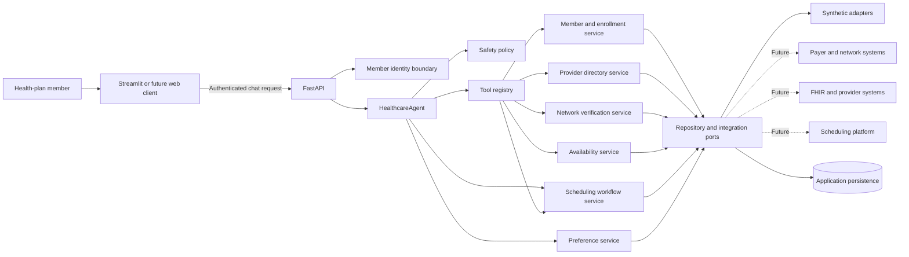
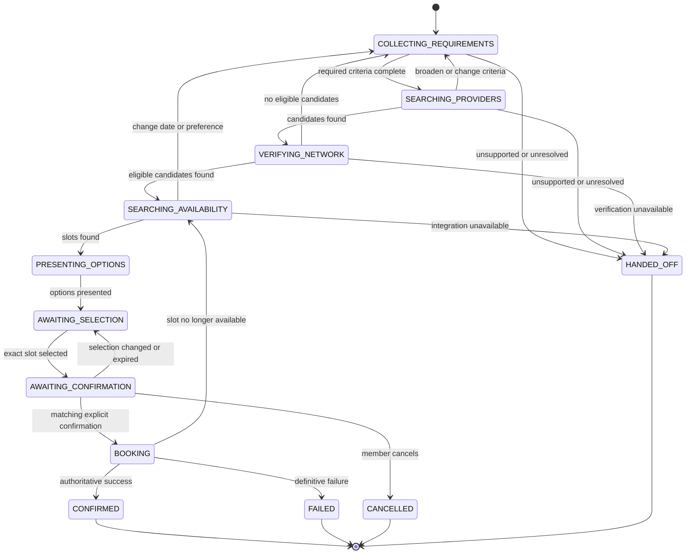
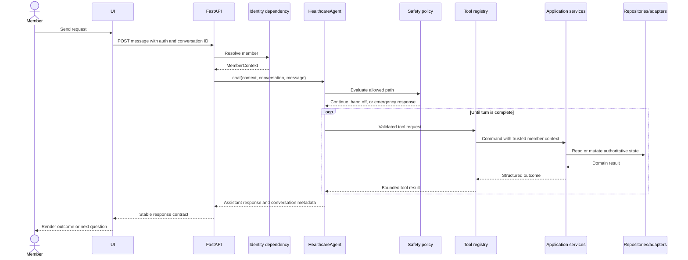

# Target Architecture

## Purpose

This document defines the target architecture for the Provider Navigation and
Scheduling Agent described in `docs/product-spec.md`. It preserves the current
separation between the user interface, FastAPI, `HealthcareAgent`, memory, and
tools while introducing explicit domain, workflow, identity, persistence,
safety, and integration boundaries.

The target is a production-quality reference application that uses synthetic
healthcare data. It must be possible to replace synthetic adapters with real
healthcare integrations without redesigning the agent or allowing the language
model to become the source of truth for network status, availability, or
booking.

## Architectural Principles

1. **One conversational orchestrator first.** `HealthcareAgent` coordinates the
   conversation and tool use. Specialized services perform deterministic
   healthcare operations. Multiple autonomous agents are not required for the
   MVP.
2. **Authoritative data stays outside the model.** Member enrollment, provider
   data, network participation, slots, appointments, and confirmations come
   from application services and their backing repositories.
3. **The model proposes; the application validates.** Every tool request is
   schema-validated, authorized, and checked against workflow state before it
   can read member data or cause a booking.
4. **Identity is server supplied.** The language model and client message cannot
   select a member identifier. FastAPI resolves authenticated member context and
   injects it into the orchestration boundary.
5. **Booking is a stateful transaction.** Explicit confirmation, slot
   revalidation, idempotency, and authoritative confirmation are enforced by a
   workflow service rather than by prompt instructions alone.
6. **Ports separate policy from integrations.** Application-facing interfaces
   remain stable while synthetic, database, payer, FHIR, and scheduling
   implementations can change.
7. **Fail closed.** Unknown network status, missing authorization, ambiguous
   booking results, and invalid state transitions never become successful user
   outcomes.
8. **Synthetic does not mean simplistic.** Synthetic records include realistic
   identifiers, effective dates, locations, networks, slot conflicts, and
   failures, but never originate from real member data.
9. **Migrate incrementally.** Existing tools remain usable while their
   hardcoded handlers are replaced behind interfaces one capability at a time.

## Current-to-Target Summary

| Area | Current repository | Target architecture |
| --- | --- | --- |
| HTTP boundary | FastAPI validates a message and calls a singleton agent | FastAPI resolves identity, conversation, and request context, then calls a request-safe agent |
| Conversation | One in-process `messages` list shared by the cached agent | Conversation history is isolated by member and conversation and loaded through a repository |
| Identity | Hardcoded `"deepak"` | Authenticated `MemberContext` supplied by a FastAPI dependency |
| Memory | In-process dictionary and regular-expression extraction | Member-scoped preference service with provenance, correction, and persistence |
| Provider search | One hardcoded provider | `ProviderDirectoryService` backed initially by synthetic repositories |
| Insurance logic | Insurer acceptance always returns true | Plan- and date-specific `NetworkVerificationService` returning in-network, out-of-network, or unknown |
| Availability | Not modeled | Stable slots returned by `AvailabilityService` |
| Booking | Immediately returns a hardcoded confirmation | Workflow-enforced confirmation, slot revalidation, idempotent booking, and service confirmation |
| Workflow state | Implied by the prompt and chat history | Persisted `SchedulingWorkflow` with validated transitions |
| Persistence | Process local | Repository interfaces with synthetic/in-memory implementations first and SQL implementations later |
| Safety | Primarily system-prompt instructions | Pre-model and pre-action policy checks plus authorization and workflow enforcement |
| Tests | Import-time smoke scripts | Unit, contract, integration, agent evaluation, security, concurrency, and end-to-end suites |
| Observability | General logging | Correlated, structured, redacted workflow, tool, and audit events |

Empty scaffold files currently present under `app/agent`, `app/memory`, and
`app/models` should not dictate the target structure. They may be reused when
their responsibility matches this design or removed in a later, explicit
cleanup.

## Target System Context



## Layer and Component Responsibilities

### User Interface

The Streamlit UI remains an API client. It is responsible for:

- Capturing member messages
- Displaying assistant messages, provider options, limitations, and booking
  summaries
- Carrying an authentication token and conversation identifier
- Making confirmation actions clear to the member
- Showing recoverable errors without exposing internal details

The UI must not call the LLM, repositories, or healthcare adapters directly. A
future web or mobile client should use the same API contract.

### FastAPI

FastAPI remains the HTTP boundary. It is responsible for:

- Request and response validation
- Authentication dependency execution
- Resolving or creating a conversation identifier
- Establishing correlation and request identifiers
- Applying request-size and rate limits
- Passing `MemberContext`, `conversation_id`, and the user message to the agent
- Translating known application errors into stable HTTP responses

FastAPI must not extract memory, evaluate network participation, select
providers, or perform booking logic.

The target orchestration call is conceptually:

```python
response = agent.chat(
    member_context=member_context,
    conversation_id=conversation_id,
    user_input=request.message,
)
```

### HealthcareAgent

`HealthcareAgent` owns conversational orchestration. It is responsible for:

- Building bounded model context from the system prompt, conversation history,
  workflow state, and approved member preferences
- Calling the language model
- Executing registered tools through the tool registry
- Feeding structured tool results back into the model
- Continuing the tool loop until the current turn is complete
- Returning a concise user-facing response

It is not responsible for:

- Authenticating the member
- Deciding whether a member may access another member's data
- Calculating network participation
- Mutating a booking outside the workflow service
- Generating confirmation identifiers
- Treating model output as persisted workflow state

The agent should be safe for concurrent requests. Mutable conversation history
must not live in a process-global singleton. Dependencies may be long-lived, but
member and conversation state must be request-scoped or repository-backed.

### Tool Registry and Tool Handlers

The existing registry pattern remains. Target tool handlers are thin adapters
between model-facing schemas and application services. They:

- Validate model-provided arguments with typed schemas
- Receive trusted member and conversation context from the server
- Call one application capability
- Return structured, bounded results
- Convert domain errors into explicit tool outcomes

Tool arguments must not include an authoritative `member_id`, network status,
booking status, or confirmation number supplied by the model. Those values come
from trusted context or services.

Initial target tools are:

- `get_member_context`
- `search_providers`
- `verify_network`
- `search_availability`
- `prepare_booking_confirmation`
- `book_confirmed_appointment`

The exact tool names may evolve, but preparation and booking must remain
separate operations.

### Application Services

Application services implement use cases and enforce product rules:

- `MemberProfileService` retrieves the member and active enrollment.
- `ProviderDirectoryService` searches provider and location records.
- `NetworkVerificationService` determines plan-specific network status.
- `AvailabilityService` retrieves and revalidates appointment slots.
- `ProviderRankingService` applies required filters and deterministic ranking
  inputs before the agent explains results.
- `PreferenceService` loads and updates approved member preferences.
- `SchedulingWorkflowService` owns state transitions, confirmation, idempotency,
  and booking.
- `SafetyPolicyService` classifies supported, unsupported, and emergency paths
  and enforces action restrictions.

Services accept and return domain types. They do not accept unvalidated model
messages or produce conversational prose.

### Domain Layer

The domain layer contains healthcare concepts, value objects, invariants, and
workflow rules. It must not depend on FastAPI, OpenAI, Streamlit, SQLAlchemy, or
vendor SDKs.

### Infrastructure and Adapters

Infrastructure implements application ports:

- Synthetic repositories and services
- SQL persistence
- OpenAI client adapter
- Future FHIR, payer, provider-directory, and scheduling adapters
- Structured logging and telemetry exporters

External payloads must be translated into domain models at the adapter
boundary. Vendor-specific fields must not leak into the agent or domain layer.

### Composition Root

Application startup should construct repositories, services, tool handlers, and
the agent in one composition root. Route modules should depend on provider
functions rather than instantiate global mutable application state.

FastAPI dependency overrides should allow tests to substitute fake identity,
LLM, repositories, and service adapters.

## Domain Model

Domain identifiers should be opaque strings or typed value objects rather than
display names.

### Member and Coverage

**Member**

- `member_id`
- `display_name`
- `date_of_birth` when needed by a supported synthetic workflow
- `status`

**Enrollment**

- `enrollment_id`
- `member_id`
- `health_plan_id`
- `effective_start`
- `effective_end`
- `status`

**HealthPlan**

- `health_plan_id`
- `payer_id`
- `product_name`
- `product_type`
- `network_id`

**ProviderNetwork**

- `network_id`
- `name`
- `effective_start`
- `effective_end`

The active enrollment for the requested service date determines the relevant
health plan and network. The member or model does not directly choose the
network identifier.

### Provider Directory

**Provider**

- `provider_id`
- `display_name`
- `specialty_codes`
- `gender`
- `languages`
- `active`

**ProviderLocation**

- `provider_location_id`
- `provider_id`
- `location_id`
- `address`
- `time_zone`
- `modalities`
- `active`

**NetworkParticipation**

- `participation_id`
- `network_id`
- `provider_id`
- `provider_location_id`
- `specialty_or_service_code`
- `effective_start`
- `effective_end`
- `status`
- `source_reference`
- `verified_at`

Network participation is evaluated using the network, provider, provider
location, specialty or service, and service date. Insurer name alone is never a
network key.

### Search and Ranking

**ProviderSearchCriteria**

- Specialty
- Geographic origin and maximum distance
- Date range
- Required modality
- Hard constraints
- Soft preferences

**ProviderMatch**

- Provider and location identifiers
- Network verification result
- Matching attributes
- Distance
- Deterministic rank inputs
- Human-readable reason codes

The application service applies hard filters. The language model may explain
reason codes but must not rewrite network status or ranking inputs.

### Scheduling

**AppointmentSlot**

- `slot_id`
- `provider_id`
- `provider_location_id`
- `start_at`
- `end_at`
- `time_zone`
- `modality`
- `status`
- `version`

**AppointmentSelection**

- `slot_id`
- `member_id`
- `workflow_id`
- Snapshot of the exact provider, location, time, modality, and network result

**BookingConfirmationRequest**

- `workflow_id`
- `selection_fingerprint`
- `presented_at`
- `expires_at`

**Appointment**

- `appointment_id`
- `member_id`
- `slot_id`
- `status`
- `confirmation_number`
- `idempotency_key`
- `created_at`

The selection fingerprint binds confirmation to the exact details shown to the
member. Any material change invalidates confirmation and returns the workflow to
selection or availability search.

### Conversation, Preferences, and Audit

**Conversation**

- `conversation_id`
- `member_id`
- `status`
- Timestamps

**ConversationMessage**

- `message_id`
- `conversation_id`
- `role`
- Bounded content or structured reference
- Timestamp

**MemberPreference**

- `preference_id`
- `member_id`
- `type`
- `value`
- `strength` (`required` or `preferred`)
- `source`
- `created_at`
- `updated_at`
- Optional expiration

**SchedulingWorkflow**

- `workflow_id`
- `member_id`
- `conversation_id`
- Current state
- Search criteria
- Selected provider and slot references
- Confirmation fingerprint and expiration
- Idempotency key
- Version for optimistic concurrency
- Timestamps

**ToolExecutionEvent**

- Correlation, conversation, workflow, and tool identifiers
- Sanitized request and outcome metadata
- Duration and status
- Timestamp

**AuditEvent**

- Actor and member identifiers
- Authorized action
- Resource reference
- Outcome
- Correlation identifier
- Timestamp

Audit records describe actions and outcomes, not hidden chain-of-thought.

## Service Interfaces

The following Python-like contracts describe architectural boundaries, not
final implementation syntax.

```python
class MemberProfileService(Protocol):
    def get_member_context(
        self, member_id: str, service_date: date
    ) -> MemberCoverageContext: ...


class ProviderDirectoryService(Protocol):
    def search(
        self, criteria: ProviderSearchCriteria
    ) -> list[ProviderCandidate]: ...


class NetworkVerificationService(Protocol):
    def verify(
        self,
        coverage: MemberCoverageContext,
        provider_id: str,
        provider_location_id: str,
        specialty_or_service_code: str,
        service_date: date,
    ) -> NetworkVerificationResult: ...


class AvailabilityService(Protocol):
    def search(self, query: AvailabilityQuery) -> list[AppointmentSlot]: ...
    def get_current_slot(self, slot_id: str) -> AppointmentSlot: ...


class ProviderRankingService(Protocol):
    def rank(
        self,
        matches: list[ProviderMatch],
        criteria: ProviderSearchCriteria,
    ) -> list[RankedProviderOption]: ...


class PreferenceService(Protocol):
    def load(self, member_id: str) -> list[MemberPreference]: ...
    def save(self, member_id: str, preference: PreferenceChange) -> None: ...


class SchedulingWorkflowService(Protocol):
    def start_or_resume(
        self, member_context: MemberContext, conversation_id: str
    ) -> SchedulingWorkflow: ...

    def prepare_confirmation(
        self, workflow_id: str, slot_id: str
    ) -> ConfirmationSummary: ...

    def book(
        self,
        workflow_id: str,
        confirmation_fingerprint: str,
        member_confirmation: ExplicitConfirmation,
    ) -> BookingResult: ...
```

Repository ports support these services:

- `MemberRepository`
- `EnrollmentRepository`
- `HealthPlanRepository`
- `ProviderRepository`
- `NetworkParticipationRepository`
- `SlotRepository`
- `AppointmentRepository`
- `PreferenceRepository`
- `ConversationRepository`
- `WorkflowRepository`
- `AuditEventRepository`

Repositories must enforce member scoping where applicable. Booking and workflow
repositories must support atomic operations or transactions for slot
revalidation, idempotency, and state changes.

## Scheduling Workflow State Machine

The workflow state is authoritative and persisted independently of chat history.



### Transition Rules

- Only the workflow service may change workflow state.
- Model text cannot constitute a state transition without a validated
  application command.
- Confirmation is valid only for the current selection fingerprint and before
  its expiration.
- Booking is permitted only from `AWAITING_CONFIRMATION`.
- The service revalidates the slot immediately before booking.
- Repeated confirmation reuses the workflow's idempotency key and returns the
  original booking result.
- Ambiguous timeouts do not create a second booking attempt until the original
  transaction is reconciled.
- Emergency detection can terminate or suspend any pre-booking state and return
  a safe escalation response.
- A new explicit member instruction may revise criteria and move the workflow
  back to an earlier valid state.

## End-to-End Request Flow



For a booking turn, `SchedulingWorkflowService` additionally validates the
confirmation fingerprint, rechecks the slot, writes the appointment and
workflow state atomically, and returns the stored confirmation.

## Synthetic Data Layer

### Goals

The synthetic layer must exercise the same application ports and invariants as
future external integrations. The agent must not know whether data came from a
synthetic adapter or a production system.

### Seed Data

Version-controlled seed files should define:

- Members and effective-dated enrollments
- Health plans and provider networks
- Providers, specialties, languages, and practice locations
- Effective-dated network participation
- Appointment schedules and slots
- Member preferences
- Failure scenarios and stale records used by evaluations

Identifiers must be stable across test runs. Dates should either be generated
relative to an injected clock or refreshed through a deterministic seed command
so that "next week" scenarios remain reproducible.

### Adapter Behavior

Synthetic adapters must support:

- Multiple members with isolated data
- Plan- and location-specific network differences
- `in_network`, `out_of_network`, and `unknown` outcomes
- Active, future, and expired records
- Filtering and ranking inputs
- Slot availability and version changes
- Atomic slot booking
- Idempotent repeated booking
- Configurable timeouts, failures, and ambiguous outcomes

The first implementation may use in-memory repositories loaded from fixtures
for unit tests and local exploration. Stateful multi-request demonstrations
should move to the same SQL repository interfaces used by the target
persistence layer.

### Synthetic Data Disclosure

The UI and responses must clearly identify the environment as synthetic. The
seed data must not use real member identifiers or copied production records.

## Persistence Boundaries

### Reference Data

Members, plans, networks, providers, locations, and network participation begin
as versioned synthetic seed data. SQL-backed repositories become appropriate
when the application needs querying, concurrent users, administrative updates,
or integration synchronization.

### Transactional State

The following state must become durable before concurrent or multi-process use:

- Conversations and bounded message history
- Scheduling workflows and versions
- Appointment selections and confirmation fingerprints
- Slot status or holds
- Appointments and idempotency keys
- Approved member preferences
- Audit events

A relational database such as PostgreSQL is the target because booking requires
transactions, uniqueness constraints, and concurrency control. Schema changes
should be managed with migrations.

### Transaction Requirements

- `idempotency_key` must be unique for a booking operation.
- A slot cannot be confirmed by more than one active appointment.
- Workflow updates use optimistic locking or row-level locking.
- Slot revalidation, appointment creation, and workflow confirmation occur in a
  transaction when controlled by the same persistence system.
- External scheduling adapters require a reconciliation strategy because local
  database and vendor operations cannot share one transaction.

### Conversation and Prompt Context

Persisted conversation history is not automatically injected in full. A context
builder should select:

- The system policy
- Recent relevant turns
- Current structured workflow state
- Approved member preferences
- Bounded tool results needed for the current decision

This prevents unbounded prompt growth and reduces accidental exposure of
unnecessary data.

### Memory Boundary

Preference memory, workflow state, and conversation history are distinct:

- Preferences represent reusable member choices.
- Workflow state represents the current scheduling transaction.
- Conversation history supports natural interaction.

`MemoryExtractor` may suggest candidate preferences, but persistence should
occur through `PreferenceService`, with provenance and correction support.
Current explicit instructions always override stored preferences.

## Authentication and Authorization Boundary

### MVP Development Identity

Local development may use a clearly labeled synthetic identity dependency, such
as a configured synthetic member or a validated development-only header.

The development identity mechanism must:

- Be disabled outside local and test environments
- Resolve only known synthetic members
- Produce the same `MemberContext` used by future authentication
- Be replaceable through FastAPI dependency injection

A raw member identifier from the request body, model, or tool arguments is
never authoritative.

### Production Identity

A future production adapter validates an OAuth 2.0 or OpenID Connect token and
maps its subject and claims to an internal member identity. SMART on FHIR may be
used when an EHR or compatible healthcare system is the authorization context.

`MemberContext` should include:

- Authenticated subject
- Internal member identifier
- Permitted role
- Tenant or organization identifier when applicable
- Authentication method and relevant scopes
- Correlation metadata

### Authorization Enforcement

- API dependencies authenticate the caller.
- Application services authorize access to member-scoped resources.
- Repositories include member or tenant constraints as defense in depth.
- Tool handlers inject trusted context instead of accepting identity from the
  model.
- Audit events capture sensitive reads and transactional actions.

The agent prompt is not an authorization control.

## Safety Controls

Safety is enforced in multiple layers:

### Before Model Orchestration

- Validate request size and content type.
- Resolve authenticated member context.
- Detect emergency or clearly unsupported clinical requests.
- Prevent real-data use in environments designated synthetic.

### During Orchestration

- Keep system policy separate from retrieved or tool-provided content.
- Treat provider and integration text as untrusted data.
- Use typed, bounded tool schemas.
- Limit tool availability by workflow state and member authorization.
- Require structured outcomes rather than model interpretation of free-form
  vendor responses.

### Before Side Effects

- Require an exact, unexpired confirmation fingerprint.
- Revalidate member, plan, network result, slot, and workflow state.
- Enforce idempotency.
- Reject mismatched member or conversation context.
- Fail closed on unknown or ambiguous outcomes.

### In User Responses

- Never describe `unknown` network status as in-network.
- Never guarantee coverage, benefits, or cost.
- Never claim availability or booking without service evidence.
- Clearly disclose synthetic data and unresolved limitations.
- Provide a human-support path for unsupported or unresolved cases.
- Provide an emergency response instead of continuing scheduling when
  applicable.

### Data and Operational Safety

- Redact secrets and unnecessary member attributes from logs.
- Do not log hidden model reasoning.
- Apply retention and deletion policies by data category.
- Encrypt production data in transit and at rest when real integrations are
  introduced.
- Maintain dependency, secret, backup, incident-response, and recovery
  practices before processing real health data.

## Observability and Audit

Every request should carry a correlation identifier through API, agent, tools,
services, repositories, and external adapters.

Operational telemetry should include:

- Request latency and outcome
- Model calls, duration, token usage, and errors
- Tool calls, duration, and structured outcome category
- Workflow state transitions
- Provider result and network-unknown counts
- Slot-loss, booking, duplicate-prevention, and reconciliation outcomes
- Safety escalation and human-handoff categories

Logs should contain identifiers and reason codes needed to diagnose behavior,
not raw secrets, unnecessary member data, or complete prompts by default.

Audit records are separate from debug logs and should be append-only at the
application boundary.

## Error Model

Application services should return typed outcomes or raise known domain errors:

- `AuthenticationRequired`
- `AuthorizationDenied`
- `MemberCoverageNotFound`
- `ProviderNotFound`
- `NetworkStatusUnknown`
- `NoMatchingProviders`
- `NoAvailableSlots`
- `InvalidWorkflowTransition`
- `ConfirmationRequired`
- `ConfirmationExpired`
- `SlotNoLongerAvailable`
- `DuplicateBooking`
- `BookingOutcomeUnknown`
- `IntegrationUnavailable`
- `HumanHandoffRequired`

Tool handlers translate these into structured results the agent can explain.
FastAPI maps them to stable client responses where an HTTP-level distinction is
needed. Unknown exceptions are logged with correlation data and returned as
generic failures.

## Testing Strategy

### Unit Tests

Test domain rules and application services without FastAPI or the LLM:

- Effective enrollment selection
- Plan-to-network resolution
- Location- and date-specific network verification
- Required filters versus soft preferences
- Deterministic ranking inputs
- Workflow transition rules
- Confirmation fingerprint creation and expiration
- Slot revalidation
- Idempotent booking
- Preference override and member isolation
- Error-to-outcome mapping

### Repository and Adapter Contract Tests

Every implementation of a port must pass the same contract suite:

- Synthetic and SQL repository behavior
- Provider search semantics
- Network status semantics
- Slot status and version behavior
- Booking idempotency
- Timeout and ambiguous-outcome behavior

Future external adapters can therefore replace synthetic adapters without
changing application expectations.

### Integration Tests

Test composed application behavior with deterministic fakes:

- FastAPI validation and dependency injection
- Authenticated member scoping
- Conversation isolation
- Tool schema validation
- Tool-to-service wiring
- Persistence transactions and concurrency
- Structured error responses
- Audit and correlation propagation

### Agent Tests and Evaluations

Use a fake or recorded model response for deterministic CI tests. Evaluate the
real configured model separately against a versioned scenario set.

Required scenarios include:

- Complete request in one turn
- Missing specialty, location, or date
- In-network and out-of-network providers with the same insurer brand
- Location-specific network differences
- Unknown or expired network participation
- No providers and no slots
- Hard constraints versus soft preferences
- Slot lost before booking
- Booking failure and ambiguous timeout
- Repeated confirmation
- Confirmation after selection changes
- Cross-member memory and workflow access attempts
- Prompt injection inside provider or tool data
- Medical-advice and emergency requests
- Fabricated provider, network, slot, and confirmation prevention

Critical assertions require zero:

- Bookings without confirmation
- Duplicate bookings
- Fabricated confirmations
- In-network claims without a matching participation record
- Cross-member data exposure

### End-to-End Tests

Run the UI or API against synthetic adapters and target persistence:

1. Authenticate as a synthetic member.
2. Request an in-network provider using preferences.
3. Inspect presented provider and slot evidence.
4. Select an appointment.
5. Confirm exact details.
6. Verify one stored appointment and service confirmation.
7. Repeat confirmation and verify no duplicate.

End-to-end failure journeys should cover slot loss, integration failure, safe
handoff, and emergency language.

### Test Data and Time

Tests use factories and synthetic fixtures. An injected clock controls effective
dates, relative date requests, confirmation expiry, and slot availability.
Random generation must use fixed seeds when reproducibility matters.

## Proposed Package Direction

The final package layout may evolve incrementally toward:

```text
app/
  api/
    dependencies/
    routes/
    schemas/
  agent/
    healthcare_agent.py
    context_builder.py
  domain/
    member.py
    network.py
    provider.py
    scheduling.py
    workflow.py
  services/
    member_profile.py
    provider_directory.py
    network_verification.py
    availability.py
    provider_ranking.py
    preferences.py
    scheduling_workflow.py
    safety_policy.py
  ports/
    repositories.py
    integrations.py
  adapters/
    synthetic/
    persistence/
    llm/
    future/
  tools/
    registry.py
    member.py
    provider.py
    network.py
    scheduling.py
  memory/
    extractor.py
  prompts/
  ui/
```

This is a destination, not a request for an immediate repository-wide move.
Each migration phase should add only the packages required by that phase.

## Incremental Migration Plan

### Phase 0: Establish a Safety Net

Goal: protect current behavior before structural changes.

- Replace import-time smoke scripts with a real test runner and assertions.
- Mock the LLM in unit and API tests.
- Cover the current chat route, memory workflow, tool registry, and tool loop.
- Add formatting, static checks, and tests to the normal development command.

Exit criterion: current behavior can be refactored without calling OpenAI or
depending on mutable external state in tests.

### Phase 1: Introduce Domain Models and Service Ports

Goal: replace hardcoded tool logic without changing the conversational loop.

- Add typed member, plan, network, provider, participation, slot, and
  appointment models.
- Define application service and repository interfaces.
- Build versioned synthetic fixtures and in-memory adapters.
- Move existing provider and insurance behavior behind the new services.
- Keep thin compatibility handlers registered through the current tool
  registry.

Exit criterion: provider and network results come from structured synthetic
records, and service tests establish plan-specific network behavior.

### Phase 2: Add Availability and Explicit Workflow State

Goal: implement the complete synthetic navigation path before booking.

- Add `AvailabilityService`.
- Add `SchedulingWorkflow` and its repository.
- Implement requirement collection, provider search, network verification,
  availability, option presentation, and selection states.
- Store workflow state separately from chat history.

Exit criterion: a member can reach `AWAITING_CONFIRMATION` using only
authoritative synthetic results.

### Phase 3: Enforce Confirmation and Idempotent Booking

Goal: make booking a safe deterministic transaction.

- Add confirmation summaries and fingerprints.
- Separate preparation from booking tools.
- Revalidate the slot immediately before booking.
- Add idempotency and duplicate-confirmation tests.
- Return only the booking service's confirmation.

Exit criterion: every supported booking path satisfies the product
specification's critical zero-failure metrics.

### Phase 4: Replace Hardcoded Identity and Shared Conversation State

Goal: support isolated members and concurrent conversations.

- Add the FastAPI `MemberContext` dependency.
- Add the development-only synthetic identity adapter.
- Pass trusted context through agent and tool execution.
- Remove hardcoded `"deepak"`.
- Replace the cached agent's shared message list with conversation-scoped
  context.
- Add cross-member and concurrency tests.

Exit criterion: two synthetic members can use the service concurrently without
sharing memory, messages, workflows, or appointments.

### Phase 5: Add Durable Persistence

Goal: survive restarts and safely support multi-process execution.

- Implement SQL repositories and migrations.
- Persist preferences, conversations, workflows, appointments, and audit events.
- Add uniqueness, locking, and transaction constraints.
- Keep seed data and synthetic adapters available for tests.

Exit criterion: an in-progress workflow resumes after restart, and concurrent
booking attempts cannot create duplicate appointments.

### Phase 6: Add Layered Safety, Evaluation, and Observability

Goal: make quality and safety measurable.

- Add pre-model safety routing and pre-action policy enforcement.
- Add structured correlation, tool, workflow, and audit events.
- Create the versioned agent evaluation suite.
- Add failure injection and reconciliation scenarios.
- Track the success metrics from `docs/product-spec.md`.

Exit criterion: critical safety evaluations pass at 100%, and failures are
diagnosable without exposing sensitive data or hidden reasoning.

### Phase 7: Prepare Real Integration Adapters

Goal: prove that synthetic implementations can be replaced at the ports.

- Select one target customer and scheduling ecosystem.
- Map real identity, member, plan, network, provider, and scheduling contracts.
- Implement adapters in a non-production sandbox.
- Run the same adapter contract and end-to-end suites.
- Complete applicable privacy, security, consent, vendor, and operational
  readiness work before any real health data is used.

Exit criterion: a sandbox integration passes the same application contracts as
the synthetic implementation without changing domain or agent behavior.

## Deferred Decisions

This architecture deliberately does not select:

- A production identity provider
- A database library or migration framework
- A specific payer, provider-directory, EHR, or scheduling vendor
- A multi-agent topology
- A production hosting platform
- A ranking objective beyond the MVP rules
- A real-data compliance posture before the operating model and customer are
  known

These decisions should be made when product evidence or a real integration
requires them, not embedded prematurely in the conversational agent.
